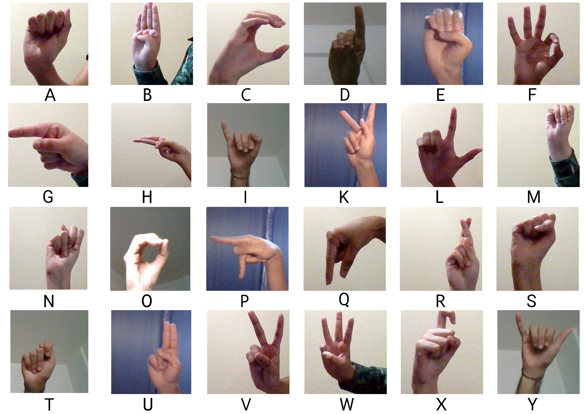

# American Sign Language (ASL) Fingerspelling Detection

## Background

According to some statistics published by CSD, there are approximately **70 million** deaf-mute people around the world (**1%** of the world's population) who use sign language. Another report by WHO crunches the numbers to **466 million** people. While translation services have become easily accessible for about 100 languages, sign language is still an area that hasn’t been explored to the same extent. But even in this age of technology and communication, we are yet to see a universal translation system that helps bridge the gap between people that can and cannot speak.

With such a large demographic of people left in the dark, it seems imperative that a reliable translation system is set up. One that will aid in breaking the language barrier and allowing indiscriminate communication with all. The goal of this project is to detect and accurately translate the letters in American Sign Language (ASL). This can later be expanded to many different sign languages too.

<p align="center">
  
  <br>
  <span>Alphabets in American Sign Language (ASL)</span>
</p>

>   #### J & Z
>
>   J & Z are the only letters in ASL that require motion. As a consequence, I decided to skip these letters as these would be difficult to detect. Henceforth, any mention of ASL means all letters from A-Z excluding J & Z unless otherwise specified.

## Plan Of Work

The project shall be implemented by using the power of machine learning. Using transfer learning on 3 well-known models, namely, MobileNet, ResNet, and Inception. These are convolutional neural networks which are used on images. The dataset used to train the model is a combination of multiple datasets comprising from online sources and self-created images. The goal is to translate the letters of ASL given as input through a webcam in real-time.

## Results

<p align="center">
  
  <br>
  <span>Real-time fingerspelling detection of ASL</span>
</p>

#### Transfer Learning Model

| Model                 | Size      | Accuracy  | Parameters |
|-----------------------|:---------:|:---------:|:----------:|
| MobileNetV2           | 14 MB     | 0.713     | 3,538,984  |
| Xception              | 88 MB     | 0.790     | 22,910,480 |
| Inceptionv3           | 92 MB     | 0.779     | 23,851,784 |
| Inception-ResNetv2    | 215 MB    | 0.803     | 55,873,736 |

#### Trained Model

| Model                 | Size      | Accuracy  | Parameters    |
|-----------------------|:---------:|:---------:|:-------------:|
| MobileNetV2           | 91 MB     | 0.91833   | 7,934,872     |
| Xception              | 100 MB    | 0.90828   | 8,721,304     |
| Inceptionv3           | 99 MB     | 0.92359   | 8,598,424     |
| Inception-ResNetv2    | 93 MB     | 0.84838   | 8,074,136     |

## Installation

### Clone the repository

This is the easy step.

```bash
$ git clone https://github.com/Mohammed-Shoaib/ASL-Fingerspelling [PATH TO DIRECTORY]
```

### Install dependencies

You will require the following dependencies:

* [Python 3](https://www.python.org/downloads/)
* [Numpy](https://www.scipy.org/install.html)
* [Keras](https://keras.io/#installation)
* [Kaggle API](https://github.com/Kaggle/kaggle-api)
* [TensorFlow](https://www.tensorflow.org/install)

Download [pip](https://pip.pypa.io/en/stable/installing/) if you haven't already

```bash
$ curl https://bootstrap.pypa.io/get-pip.py -o get-pip.py   # fetch pip using curl
$ python3 get-pip.py    # install pip
```

It is recommended to create a [virtual environment](https://realpython.com/python-virtual-environments-a-primer/)

```bash
$ python3 -m venv [NAME]        # create a virtual environment
$ source NAME/Scripts/activate  # activate virtual environment: for Windows
$ source NAME/bin/activate      # activate virtual environment: for Mac/Linux
$ deactivate                    # deactivate virtual environment
```

Install the dependencies using `pip`

```bash
$ pip install --user numpy keras kaggle tensorflow
```

It is recommended to specify the `--user` flag to pip. This installs packages for the local user and does not write to system directories. Preferably, do not use `sudo pip` as this can cause problems.

## Steps

We will now go from the raw dataset to a fully-trained model!

> **Note:**
>
> The execution for each of the following steps will take sometime so please be patient and let it run for a while.

### Step 0: `extract.sh`

This step is only required if you are using our [Fingerspelling ASL](https://www.kaggle.com/shoaib98libra/american-sign-language) dataset. Run the following

```bash
$ chmod +x extract.sh   # give execute permissions for file
$ ./extract.sh          # execute
```

You should now be able to see a `data` directory in the main directory.

### Step 1: `create_mapping.py`

Helps to create a json file with the required labels. Define a string of labels for the dataset or leave blank for ASL. Then, run the following

```bash
$ python create_mapping.py -s [LABELS] -o [OUTPUT FILE]
```

For example,

```bash
$ python create_mapping.py -s ABC -o mapping.json
$ cat mapping.json
{
    "A": 0,
    "B": 1,
    "C": 2
}
```

### Step 2: `generate_data.py`

This step is only required if you would like to create your own dataset. You can run the following,

```bash
$ python generate_data.py -d [PATH TO OUTPUT DATA] -l [LABEL]
```

The images will be saved in numeric order in the specified output directory with the label. For example,

```bash
$ python generate_data.py -d ../data -l A
```

### Step 3: `config.py`

Tune the model parameters based on your application. The following parameters can be tweaked:

*   `EPOCHS` — number of passes through the training set, _default = 64_
*   `SHAPE` — the shape of square image, _default = 250_
*   `CHANNELS` — number of color channels, _default = 3_
*   `BATCH_SIZE` — number of training samples used in one iteration, _default = 128_

### Step 4: `serialize_data.py`

From [Microsoft Docs](https://docs.microsoft.com/en-us/dotnet/csharp/programming-guide/concepts/serialization/):

> Serialization is the process of converting an object into a stream of bytes to store the object or transmit it to memory, a database, or a file. Its main purpose is to save the state of an object in order to be able to recreate it when needed. The reverse process is called deserialization.

We will now load our data, split it into train & test sets, serialize the objects, and store it in memory. Serialization will allow us to have faster training as preprocessing the dataset can take time. You can serialize by running the following

```bash
$ python serialize_data.py -d [PATH TO DATASET] -o [PATH TO OUTPUT DIRECTORY]
```

For example,

```bash
$ python serialize_data.py -d ../data -o ../ser
```

### Step 5: `serialize_activation.py`

We have used transfer learning to get a foundation for the model configuration. On top of this, we will use additional layers that our model will be trained upon.

>   #### Transfer Learning
>
>   Transfer learning makes use of knowledge gained while solving one problem and applying it to a different but related problem. It is a popular approach in deep learning as it provides a very strong foundation and a starting point given the vast amount of time and resources required to solve the related problem from scratch.
>   In our case, we will use transfer learning models that have been trained to recognize patterns in images. As we are focusing on fingerspelling sign language, we do not require motion making it a related problem of finding patterns.

Keras has many available models to choose from available in [`keras.applications`](https://keras.io/applications/). I have made available the following:

*   MobileNetV2
*   Xception
*   Inceptionv3
*   Inception-ResNetv2

These were chosen carefully due to their ability to perform well on images and computer vision related tasks.

We will now use the dataset and get the transfer learning model activations. Similar to before we will then serialize the model activations as this will significantly decrease the training time. Choose your transfer learning model, then, run the following

```bash
$ python serialize_activation.py -d [PATH TO SERIALIZED DATASET] -o [PATH TO OUTPUT DIRECTORY]
```

For example,

```bash
$ python serialize_activation.py -d ../ser -o ../models
```

### Step 6: `train.py`

The moment that we have been waiting for has finally come! Let the training begin. Run the following command

```bash
$ python train.py -d [PATH TO SERIALIZED DATASET] -a [PATH TO SERIALIZED ACTIVATIONS] -lm [TRANSFER LEARNING MODEL] -m [PATH TO CREATE/UPDATE MODEL] -l [PATH TO LOG DIRECTORY] -s [START INDEX OF DATASET] -e [END INDEX OF DATASET]
```

For example,

```bash
$ python train.py -d ../ser -a ../models/mobilenetv2 -lm mobilenetv2 -m ../models/mobilenetv2/model.h5 -l ../models/mobilenetv2/logs -s 0 -e 80000
```

### Step 7: `predict.py`

Now that the training has been completed, it's time to test the performance of our model. Run the following command

```bash
$ python predict.py -d [PATH TO SERIALIZED DATASET] -lm [TRANSFER LEARNING MODEL] -m [PATH TO TRAINED MODEL] -s [NUMBER OF SAMPLES TO TEST] [-l [LIVE DEMO PREDICTION]]
```

For example,

```bash
$ python predict.py -d ../ser -lm mobilenetv2 -m ../models/mobilenetv2/model.h5 -s 10 -l
```

## Credits

I would like to express my sincere gratitude to the people who helped me along this project:

*   Dr. Santhosh Kumar Vasudevan — for being my mentor and guiding me throughout the period of my project
*   [Dhruv Anant Duseja](http://linkedin.com/in/dhruv-duseja) — for giving me exceptional ideas, doing the research, and also contributing in the creation of the dataset
*   [Sadia Fatima](https://www.linkedin.com/in/sadiyafatima95/) — for providing me moral support and contributing in the creation of the dataset
*   [Shaun Fernandes](http://linkedin.com/in/fernandes-shaun) — for giving me great advice, sorting out technical difficulties, and also contributing in the creation of the dataset
*   [Sumaiya Fatima](https://www.linkedin.com/in/sumaiya-fatima/) — for designing many of the assets and contributing in the creation of the dataset